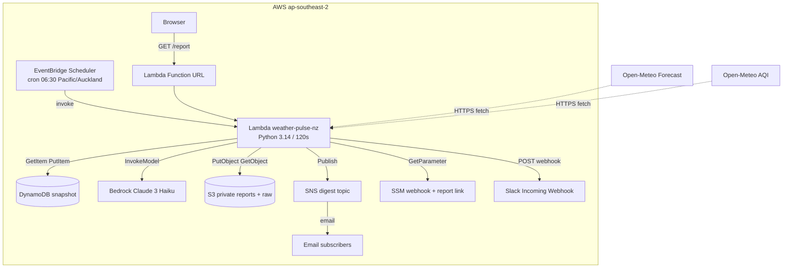
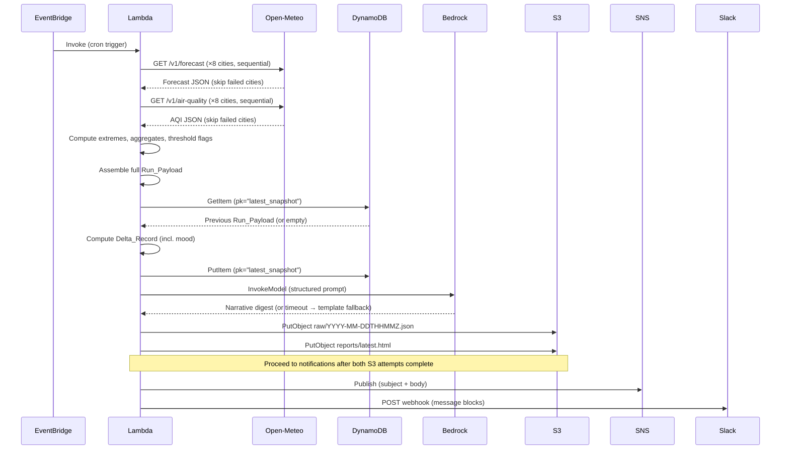

# Design Document: Weather Pulse NZ

## Overview

Weather Pulse NZ is a single-Lambda scheduled agent deployed to `ap-southeast-2` that runs daily at 06:30 Pacific/Auckland. It fetches weather forecast and air quality data for 8 New Zealand cities from the Open-Meteo free API, computes extremes/aggregates and deltas against the previous run stored in DynamoDB, generates a narrative digest via Amazon Bedrock Claude (mood always from delta thresholds), and delivers results to three output channels: Slack webhook, SNS email, and a private S3 HTML report exposed through a short Lambda Function URL (`…/report`). Forecast and AQI fetches run in parallel; remaining pipeline steps are sequential. All infrastructure is defined in Terraform.

### Key Design Decisions

| Decision | Rationale |
| ---------- | ----------- |
| Single Lambda for pipeline + report URL | One function handles schedule invoke and GET report/assets; non-GET returns 405 |
| Parallel forecast + AQI fetch | Cuts wall-clock time within 120s budget; per-city fetches remain sequential within each API |
| DynamoDB single-item state | Minimal cost; only one snapshot needed for delta comparison |
| Open-Meteo (free tier) | CC BY 4.0 license, no API key required, adequate resolution for NZ |
| Bedrock Claude with template fallback | Narrative quality with graceful degradation; mood owned by delta logic |
| Private S3 + Function URL proxy | Short links in notifications without public bucket or long pre-signed URLs |
| SSM SecureString for Slack webhook | Avoids secrets in git; placeholder created by Terraform |
| SSM String for report link base | Function URL base for `/report` and branding assets |

## Architecture

### High-Level Architecture Diagram



### Execution Pipeline (Scheduled Invoke)

Forecast and AQI collection run concurrently (two thread-pool workers). Remaining steps are sequential. S3 write attempts complete before notification delivery (Requirement 7.6).


## Components and Interfaces

### Module Structure

```text
src/
├── handler.py              # Lambda entry: GET report/assets / 405, or daily pipeline
├── config.py               # City coordinates, thresholds, constants
├── branding.py             # Favicon / OG helpers
├── report_link.py          # Function URL base + notification report URL
├── assets/                 # favicon.svg, favicon.png, og.jpg
├── fetch/
│   ├── forecast.py
│   └── air_quality.py
├── compute/
│   ├── extremes.py
│   ├── deltas.py
│   └── thresholds.py
├── digest/
│   ├── bedrock.py
│   └── template.py
├── output/
│   ├── s3_writer.py        # Raw JSON + HTML + GetObject for proxy
│   ├── sns_publisher.py
│   └── slack_poster.py     # Mood-colored attachment + report link
└── state/
    └── dynamo.py
```

### Lambda Handler Flow

```python
def handler(event, context):
    method = http_method(event)
    if method is not None:
        if method == "GET":
            return serve_report_or_assets(event)  # /report, favicon, og
        return method_not_allowed()  # 405 — never run pipeline

    run_timestamp = datetime.now(ZoneInfo("Pacific/Auckland"))

    # 1. Fetch forecast + AQI in parallel (cities still sequential per API)
    with ThreadPoolExecutor(max_workers=2) as pool:
        forecasts = pool.submit(fetch_all_forecasts, WATCHED_CITIES).result()
        air_quality = pool.submit(fetch_all_air_quality, WATCHED_CITIES).result()

    if not forecasts:
        raise AbortRunError("No forecast data obtained for any city")

    # 2–4. Build payload, deltas, digest (mood from Delta_Record)
    ...
    write_raw_json(...)
    html_ok = write_html_report(...)
    report_url = notification_report_url() if html_ok else ""
    publish_sns(..., report_url)
    post_slack(..., report_url)
    return {"statusCode": 200, "mood": ..., "report_url": report_url or None}
```

### Configuration Module (`config.py`)

```python
from dataclasses import dataclass

@dataclass(frozen=True)
class CityConfig:
    name: str
    latitude: float
    longitude: float
    island: str  # "north" or "south"

WATCHED_CITIES = [
    CityConfig("Auckland",     -36.85, 174.76, "north"),
    CityConfig("Hamilton",     -37.79, 175.28, "north"),
    CityConfig("Tauranga",     -37.69, 176.17, "north"),
    CityConfig("Wellington",   -41.29, 174.78, "north"),
    CityConfig("Nelson",       -41.27, 173.28, "south"),
    CityConfig("Christchurch", -43.53, 172.64, "south"),
    CityConfig("Queenstown",   -45.03, 168.66, "south"),
    CityConfig("Dunedin",      -45.87, 170.50, "south"),
]

# Thresholds
WIND_NOTABLE_THRESHOLD_KMH = 40
AQI_WATCH_THRESHOLD = 100
AQI_UNHEALTHY_THRESHOLD = 150
DELTA_TEMP_THRESHOLD_C = 5.0
DELTA_AQI_THRESHOLD = 30

# Timeouts (seconds)
API_TIMEOUT_SECONDS = 10
BEDROCK_TIMEOUT_SECONDS = 30
SLACK_TIMEOUT_SECONDS = 10

# AWS Config
AWS_REGION = "ap-southeast-2"
DYNAMODB_TABLE = "weather-pulse-state"
S3_BUCKET = "weather-pulse-reports"
SNS_TOPIC_ARN_ENV = "SNS_TOPIC_ARN"
SSM_SLACK_WEBHOOK_PARAM = "/weather-pulse/slack-webhook"
REPORT_LINK_SSM_PARAM = "/weather-pulse/report-link-url"
BEDROCK_MODEL_ID = "anthropic.claude-3-haiku-20240307-v1:0"

```

## Data Models

### Run_Payload JSON Schema

```json
{
  "run_timestamp": "2026-07-17T06:30:00+12:00",
  "cities": {
    "Auckland": {
      "coordinates": {"latitude": -36.85, "longitude": 174.76},
      "island": "north",
      "forecast": {
        "daily": {
          "dates": ["2026-07-17", "2026-07-18", "2026-07-19"],
          "temperature_2m_max": [14.2, 15.1, 13.8],
          "temperature_2m_min": [8.1, 9.0, 7.5],
          "wind_gusts_10m_max": [42.0, 35.0, 28.0],
          "precipitation_sum": [2.1, 0.0, 5.4],
          "weather_code": [61, 2, 63]
        },
        "hourly": {
          "time": ["2026-07-17T06:00", "2026-07-17T07:00", "..."],
          "temperature_2m": [9.1, 8.8, "..."],
          "precipitation": [0.0, 0.1, "..."]
        }
      },
      "air_quality": {
        "us_aqi": 45,
        "pm2_5": 12.3
      }
    }
  },
  "extremes": {
    "hottest": {"cities": ["Auckland"], "value": 15.1},
    "coldest": {"cities": ["Queenstown"], "value": -2.0},
    "windiest": {"cities": ["Wellington"], "value": 65.0},
    "wettest": {"cities": ["Dunedin"], "value": 12.4},
    "largest_swing": {"city": "Queenstown", "value": 14.5},
    "island_contrast": {
      "north": {"avg_max_temp": 14.0, "avg_min_temp": 8.2, "avg_max_gust": 38.0},
      "south": {"avg_max_temp": 10.5, "avg_min_temp": 3.1, "avg_max_gust": 42.0}
    }
  },
  "threshold_flags": {
    "wind_watchouts": ["Wellington", "Auckland"],
    "aqi_watch": [],
    "aqi_unhealthy": []
  }
}

```

Extremes, island contrast, wind watchouts, and temperature deltas all use the **first forecast day** (index 0) unless otherwise noted. Hourly series are the next 24 hours from request time (`forecast_hours=24`).

### DynamoDB Item Structure

| Attribute | Type | Description |
| ----------- | ------ | ------------- |
| `pk` | String (partition key) | Always `"latest_snapshot"` |
| `run_timestamp` | String (ISO 8601) | Timestamp of the stored run |
| `payload` | String (JSON) | JSON-serialized full Run_Payload (including extremes and threshold_flags) |
| `ttl` | Number | Unix epoch + 7 days (automatic cleanup) |

The table uses on-demand capacity mode (pay-per-request) since it handles exactly one read + one write per daily run.

### Delta_Record Schema

```json
{
  "is_first_run": false,
  "comparison_unavailable": false,
  "delta_note": null,
  "new_alerts": {
    "wind_watchouts": ["Auckland"],
    "aqi_watch": [],
    "aqi_unhealthy": []
  },
  "cleared_alerts": {
    "wind_watchouts": ["Christchurch"],
    "aqi_watch": [],
    "aqi_unhealthy": []
  },
  "significant_temp_changes": [
    {"city": "Queenstown", "previous": 8.0, "current": 14.5, "delta": 6.5}
  ],
  "significant_aqi_changes": [
    {"city": "Christchurch", "previous": 120, "current": 55, "delta": -65}
  ],
  "mood": "notable"
}

```

`delta_note` is set to a short human-readable string when `is_first_run` is true (e.g. `"No prior data is available"`) or when `comparison_unavailable` is true (e.g. `"Comparison was unavailable"`); otherwise it is `null`.

Temperature deltas compare each city's **first-day daily maximum temperature** (`temperature_2m_max[0]`). Wind alert deltas compare each city's **first-day daily maximum wind gust** (`wind_gusts_10m_max[0]`).

### Mood Classification Logic

Evaluate in priority order (first match wins):

| Priority | Condition | Mood |
| ---------- | ----------- | ------ |
| 1 | Any city currently flagged `aqi_unhealthy` (US_AQI ≥ 150) | `severe` |
| 2 | No new alerts, no cleared alerts, all temp deltas < 5°C, and all AQI deltas < 30 | `quiet` |
| 3 | Any new/cleared wind or AQI alert, OR temp delta ≥ 5°C, OR AQI delta ≥ 30 | `notable` |

When mood is `quiet`, the Executive_Brief headline/bullets must state that there is no major change (Requirement 10.1).

### Executive_Brief Schema

```json
{
  "headline": "Wellington gusts hit 65 km/h as cold snap grips South Island",
  "bullets": [
    "Queenstown overnight low drops to -2°C, coldest in NZ today",
    "Auckland wind watch: gusts to 42 km/h expected",
    "All cities show good air quality (AQI < 100)",
    "South Island averaging 3.5°C cooler than North Island"
  ],
  "mood": "notable",
  "watchouts": [
    "Wellington: sustained high winds through Friday",
    "Queenstown: frost risk overnight"
  ]
}

```

## API Contracts

### Open-Meteo Forecast API

**Endpoint:** `https://api.open-meteo.com/v1/forecast`

**Request (per city):**

```http
GET /v1/forecast?latitude=-36.85&longitude=174.76
    &daily=temperature_2m_max,temperature_2m_min,wind_gusts_10m_max,precipitation_sum,weather_code
    &hourly=temperature_2m,precipitation
    &timezone=Pacific/Auckland
    &forecast_days=3
    &forecast_hours=24

```

**Response (success):**

```json
{
  "latitude": -36.85,
  "longitude": 174.76,
  "elevation": 43.0,
  "generationtime_ms": 0.5,
  "utc_offset_seconds": 43200,
  "timezone": "Pacific/Auckland",
  "timezone_abbreviation": "NZST",
  "daily": {
    "time": ["2026-07-17", "2026-07-18", "2026-07-19"],
    "temperature_2m_max": [14.2, 15.1, 13.8],
    "temperature_2m_min": [8.1, 9.0, 7.5],
    "wind_gusts_10m_max": [42.0, 35.0, 28.0],
    "precipitation_sum": [2.1, 0.0, 5.4],
    "weather_code": [61, 2, 63]
  },
  "hourly": {
    "time": ["2026-07-17T06:00", "2026-07-17T07:00", "...24 entries..."],
    "temperature_2m": [9.1, 8.8, "..."],
    "precipitation": [0.0, 0.1, "..."]
  },
  "daily_units": {
    "temperature_2m_max": "°C",
    "temperature_2m_min": "°C",
    "wind_gusts_10m_max": "km/h",
    "precipitation_sum": "mm",
    "weather_code": "wmo code"
  }
}

```

**Response (error):**

```json
{"error": true, "reason": "Cannot initialize WeatherVariable from invalid String value"}

```

### Open-Meteo Air Quality API

**Endpoint:** `https://air-quality-api.open-meteo.com/v1/air-quality`

**Request (per city):**

```http
GET /v1/air-quality?latitude=-36.85&longitude=174.76
    &current=us_aqi,pm2_5
    &timezone=Pacific/Auckland

```

**Response (success):**

```json
{
  "latitude": -36.85,
  "longitude": 174.76,
  "generationtime_ms": 0.3,
  "utc_offset_seconds": 43200,
  "timezone": "Pacific/Auckland",
  "current": {
    "time": "2026-07-17T06:30",
    "interval": 900,
    "us_aqi": 45,
    "pm2_5": 12.3
  },
  "current_units": {
    "us_aqi": "aqi",
    "pm2_5": "μg/m³"
  }
}

```

### Amazon Bedrock Prompt Contract

**Model:** `anthropic.claude-3-haiku-20240307-v1:0`

**Prompt Structure (data separated from formatting instructions):**

```text
System: You are a weather briefing writer for New Zealand. You narrate ONLY the facts 
provided. Do NOT invent data, severity levels, or thresholds beyond what is given.

User:
## DATA PAYLOAD
{json_payload}

## FORMATTING INSTRUCTIONS
Produce an Executive Brief with exactly this structure:

1. HEADLINE: One sentence, 120 characters max, capturing the most notable condition
2. BULLETS: 3 to 5 bullet points summarizing key conditions across NZ
3. MOOD: One of: quiet, notable, severe (use the mood from the delta record)
4. WATCHOUTS: Up to 3 top watchouts if any thresholds are exceeded (omit if none)

Respond in valid JSON matching this schema:
{"headline": str, "bullets": [str], "mood": str, "watchouts": [str]}

```

**Bedrock InvokeModel Request:**

```json
{
  "modelId": "anthropic.claude-3-haiku-20240307-v1:0",
  "contentType": "application/json",
  "body": {
    "anthropic_version": "bedrock-2023-05-31",
    "max_tokens": 1024,
    "system": "...",
    "messages": [{"role": "user", "content": "..."}]
  }
}

```

## Notification Payloads

Notifications use the short Function URL (`{function_url}report`) when Report_Link_Base is configured. If HTML write failed, the report link is omitted. Pre-signed S3 URLs are a fallback only when the Function URL base is unavailable.

### Slack Message Format (mood-colored attachment)

Slack uses a classic attachment with a mood-colored sidebar (`quiet` green / `notable` amber / `severe` red), headline, bullets, watchouts, and a context line: `Mood: … | View full report` linking to `…/report`.

### SNS Email Message Format

**Subject:** `Weather Pulse NZ — YYYY-MM-DD (mood)`

**Body (excerpt):**

```text
☀️ Weather Pulse NZ — Daily Briefing
🟢 QUIET   (or notable / severe banner)

📌 {headline}

KEY POINTS:
• …

WATCHOUTS:
⚠️ …

📄 Full HTML report: https://{function-url-host}/report
```

## Report Link Model

- S3 bucket stays **private**.
- Terraform creates `aws_lambda_function_url` and writes the base URL to SSM `/weather-pulse/report-link-url`.
- `GET /report` proxies `reports/latest.html` via IAM GetObject; browser address bar stays on the Function URL.
- `GET` also serves `/favicon.svg`, `/favicon.png`, `/og.jpg` from packaged assets.
- Non-GET → **405** so the public URL cannot trigger the daily pipeline (Requirement 13).

## S3 Object Structure

### Bucket Layout

```text
weather-pulse-reports/
├── raw/
│   ├── 2026-07-16T183000Z.json     # Full Run_Payload archive (UTC from NZ 06:30 run)
│   ├── 2026-07-15T183000Z.json
│   └── ...
└── reports/
    └── latest.html                   # Current HTML report (overwritten each run)

```

Raw keys use the run timestamp converted to UTC (`YYYY-MM-DDTHHMMZ`). A 06:30 Pacific/Auckland run in NZST (+12) maps to `T183000Z` on the previous UTC calendar date.

### Raw JSON Object

- **Key:** `raw/{run_timestamp_formatted}.json` where format is `YYYY-MM-DDTHHMMZ` (UTC)
- **Content-Type:** `application/json`
- **Content:** Full Run_Payload JSON (same structure as Data Models section)

### HTML Report Sections

The `reports/latest.html` file is a self-contained single-page HTML document with inline CSS:

1. **Executive Brief** — Headline, mood badge, bullets, watchouts
2. **City Snapshot Board** — Table with all 8 cities showing max/min temp, wind gust, precipitation, AQI
3. **NZ Extremes** — Hottest, coldest, windiest, wettest cities + largest swing + island contrast
4. **Air Quality Watch** — Any cities at watch (≥100) or unhealthy (≥150) levels, or "All clear"
5. **Delta vs Last Run** — New alerts, cleared alerts, significant changes, or "First run / No changes"
6. **Sources and Attribution** — Open-Meteo CC BY 4.0 credit, run timestamp, cities queried

Out of scope for must-ship (Requirement 12.5): Hourly Curve and Action Watchouts sections are deferred.

## Terraform Resource Layout

### File Structure

```text
terraform/
├── main.tf
├── variables.tf
├── outputs.tf           # Includes report_link_url (…/report)
├── lambda.tf            # Function + Function URL
├── scheduler.tf
├── dynamodb.tf
├── s3.tf
├── sns.tf
├── iam.tf               # PutObject + GetObject; SSM webhook + report-link
└── ssm.tf               # Slack webhook placeholder + report-link base
```

### Key Resources

| Resource | Terraform Type | Notes |
| ---------- | --------------- | ------- |
| Lambda Function | `aws_lambda_function` | Runtime `python3.14`, 120s timeout, 256MB memory |
| Lambda Function URL | `aws_lambda_function_url` | Public GET for `/report` and assets |
| EventBridge Schedule | `aws_scheduler_schedule` | `cron(30 6 * * ? *)` with timezone `Pacific/Auckland` |
| DynamoDB Table | `aws_dynamodb_table` | PAY_PER_REQUEST, pk (String) partition key, TTL enabled |
| S3 Bucket | `aws_s3_bucket` | Private; lifecycle rule for raw/ (30 day expiry) |
| SNS Topic | `aws_sns_topic` | Standard topic |
| SNS Subscription | `aws_sns_topic_subscription` | Email protocol |
| IAM Role (Lambda) | `aws_iam_role` | DynamoDB R/W, S3 Put/Get, SNS Publish, SSM GetParameter (webhook + report link), Bedrock, Logs |
| SSM Parameters | `aws_ssm_parameter` | Slack webhook placeholder; report-link Function URL base |

### IAM Policy (Least Privilege)

```json
{
  "Version": "2012-10-17",
  "Statement": [
    {
      "Effect": "Allow",
      "Action": ["dynamodb:GetItem", "dynamodb:PutItem"],
      "Resource": "arn:aws:dynamodb:ap-southeast-2:*:table/weather-pulse-state"
    },
    {
      "Effect": "Allow",
      "Action": ["s3:PutObject", "s3:GetObject"],
      "Resource": "arn:aws:s3:::weather-pulse-reports/*"
    },
    {
      "Effect": "Allow",
      "Action": ["sns:Publish"],
      "Resource": "arn:aws:sns:ap-southeast-2:*:weather-pulse-digest"
    },
    {
      "Effect": "Allow",
      "Action": ["ssm:GetParameter"],
      "Resource": [
        "arn:aws:ssm:ap-southeast-2:*:parameter/weather-pulse/slack-webhook",
        "arn:aws:ssm:ap-southeast-2:*:parameter/weather-pulse/report-link-url"
      ]
    },
    {
      "Effect": "Allow",
      "Action": ["bedrock:InvokeModel"],
      "Resource": "arn:aws:bedrock:ap-southeast-2::foundation-model/anthropic.claude-3-haiku-20240307-v1:0"
    },
    {
      "Effect": "Allow",
      "Action": ["logs:CreateLogGroup", "logs:CreateLogStream", "logs:PutLogEvents"],
      "Resource": "arn:aws:logs:ap-southeast-2:*:*"
    }
  ]
}
```

## Error Handling

### Error Strategy by Component

| Component | Error Type | Action | Continue? |
| ----------- | ----------- | -------- | ----------- |
| Forecast API (per city) | Timeout (>10s) / HTTP error | Log warning, skip city | Yes |
| Forecast API (all cities) | All cities failed | Abort run, raise exception | No |
| AQI API (per city) | Timeout (>10s) / HTTP error | Log warning, skip city | Yes |
| AQI API (per city) | Null/missing us_aqi or pm2_5 | Log warning, mark unavailable | Yes |
| DynamoDB read | Any error | Log error, skip delta, empty Delta_Record | Yes |
| DynamoDB write | Any error | Log error (snapshot not updated) | Yes |
| Bedrock invoke | Timeout (>30s) / error | Fall back to template digest | Yes |
| S3 write (raw JSON) | Any error | Log error | Yes |
| S3 write (HTML report) | Any error | Log error | Yes |
| SNS publish | First attempt fails | Retry once; if retry fails, log error | Yes |
| Slack POST | Non-2xx / timeout (>10s) | Retry once; if retry fails, log error | Yes |
| SSM GetParameter | Parameter not found | Log warning, skip Slack notification | Yes |

After both S3 write attempts have completed (success or failure), the agent proceeds to SNS then Slack (Requirement 7.6).

### SSM Parameter Lookup

Slack delivery reads `/weather-pulse/slack-webhook` via `GetParameter` with `WithDecryption=true` (SecureString). Terraform creates this parameter with a placeholder value; operators replace it with the real webhook URL after apply.

### Retry Strategy

- **Open-Meteo APIs:** No retry (per-city timeout is the boundary; move to next city)
- **Bedrock:** No retry (fall back to template instead)
- **SNS Publish:** 1 retry with exponential backoff (immediate → 2s)
- **Slack Webhook:** 1 retry; each attempt times out at 10 seconds
- **EventBridge Scheduler:** Built-in 2 retries within 5-minute window (AWS-managed)

### Timeout Budget

Total Lambda timeout: 120 seconds

| Phase | Budget | Notes |
| ------- | -------- | ------- |
| Forecast fetch (8 cities) | ~20s worst case | 10s timeout × 8 (sequential), but most respond in <2s |
| AQI fetch (8 cities) | ~20s worst case | 10s timeout × 8 (sequential), but most respond in <2s |
| Compute (extremes + deltas) | <1s | Pure computation |
| DynamoDB read/write | ~2s | Single item operations |
| Bedrock digest | ~30s max | Hard timeout |
| S3 writes | ~5s | Two PutObject calls |
| SNS + Slack | ~15s | Including retries |
| **Total worst case** | **~93s** | Within 120s budget |

## Idempotency Considerations

### Run Idempotency

The agent is NOT strictly idempotent — a re-run within the same day will:

1. Overwrite the DynamoDB snapshot (safe — latest wins)
2. Create a new raw JSON archive with same timestamp key (S3 PutObject overwrites)
3. Overwrite `reports/latest.html` (desired behavior)
4. Send duplicate notifications to SNS and Slack (acceptable for daily schedule)

### Design Choices for Safe Re-runs

- **S3 raw archive key** uses UTC run timestamp: duplicate runs with the same timestamp overwrite safely
- **DynamoDB single-item** means no orphan records accumulate
- **TTL on DynamoDB** (7 days) provides automatic cleanup if item format changes
- **EventBridge retry window** (5 minutes, up to 2 additional attempts) means at most 3 invocations for a failed trigger
- **Delivery semantics are at-least-once** within that retry window: duplicate SNS/Slack messages are acceptable for a daily schedule
- **No distributed lock** needed: single-Lambda sequential pipeline; concurrent overlap is unlikely under the daily schedule plus short retry window

## Correctness Properties

A property is a characteristic or behavior that should hold true across all valid executions of a system — essentially, a formal statement about what the system should do. Properties serve as the bridge between human-readable specifications and machine-verifiable correctness guarantees.

### Property 1: API URL Construction

For any valid CityConfig (with latitude, longitude, and name), the constructed forecast URL must include `temperature_2m_max`, `temperature_2m_min`, `wind_gusts_10m_max`, `precipitation_sum`, `weather_code` as daily variables, `temperature_2m` and `precipitation` as hourly variables, the city's exact coordinates, `forecast_days=3`, and `timezone=Pacific/Auckland`; and the constructed AQI URL must include `us_aqi` and `pm2_5` as current variables with the city's exact coordinates.

Validates: Requirements 2.1, 3.1

### Property 2: Partial Fetch Failure Resilience

For any subset of cities that return errors or timeouts (where at least one city succeeds), the agent's data collection phase shall return valid forecast/AQI data for all successful cities and exclude failed cities, without raising an exception.

Validates: Requirements 2.3, 3.2

### Property 3: Null AQI Field Handling

For any AQI API response where `us_aqi` or `pm2_5` is null or missing, the corresponding metric for that city shall be marked as unavailable, and the city shall be excluded from AQI-based threshold evaluations but remain included in forecast-based computations.

Validates: Requirements 3.3

### Property 4: Extreme City Identification

For any set of city forecast data (with at least one city), the identified "hottest" city must have a `temperature_2m_max` value greater than or equal to all other cities, the "coldest" must have a `temperature_2m_min` less than or equal to all others, and likewise for "windiest" and "wettest". If multiple cities share the extreme value, all tied cities must appear in the result.

Validates: Requirements 4.1

### Property 5: Temperature Swing Computation

For any set of city daily temperatures, the computed "largest day-night swing" must equal the maximum value of `(temperature_2m_max - temperature_2m_min)` across all cities with valid data for the first forecast day.

Validates: Requirements 4.2

### Property 6: Island Contrast Averaging

For any set of city forecast data partitioned into North Island (Auckland, Hamilton, Tauranga, Wellington) and South Island (Nelson, Christchurch, Queenstown, Dunedin), the island contrast averages must equal the arithmetic mean of `temperature_2m_max`, `temperature_2m_min`, and `wind_gusts_10m_max` for each island group, computed only over cities with available data.

Validates: Requirements 4.3

### Property 7: Threshold Classification

For any city with a numeric `wind_gusts_10m_max` value, it shall be flagged as a wind watchout if and only if the value is ≥ 40 km/h. For any city with a numeric `us_aqi` value, it shall be classified as "watch" if and only if 100 ≤ value < 150, and as "unhealthy" if and only if value ≥ 150. No city shall appear in both watch and unhealthy lists simultaneously.

Validates: Requirements 4.4, 4.5, 4.6

### Property 8: Missing Data Exclusion

For any set of cities where some have unavailable forecast or AQI data, the extreme and aggregate computations shall produce results using only cities with valid data, and shall never include an unavailable city in any extreme or threshold flag list.

Validates: Requirements 4.7

### Property 9: Delta Computation Correctness

For any two valid Run_Payloads (current and previous), the Delta_Record shall: list a city in `new_alerts.wind_watchouts` if and only if the city's current first-day wind gust ≥ 40 and previous first-day wind gust < 40; list a city in `cleared_alerts.wind_watchouts` if and only if the city's previous first-day wind gust ≥ 40 and current first-day wind gust < 40; list a city in `significant_temp_changes` if and only if the absolute difference between current and previous first-day `temperature_2m_max` ≥ 5°C; and list a city in `significant_aqi_changes` if and only if the absolute difference between current and previous `us_aqi` ≥ 30.

Validates: Requirements 5.2

### Property 10: Template Fallback Produces Valid Executive_Brief

For any valid combination of Run_Payload, extremes, and Delta_Record, the template-based fallback digest shall produce an Executive_Brief where: the headline is at most 120 characters, there are between 3 and 5 bullets (inclusive), the mood is one of "quiet", "notable", or "severe", and there are between 0 and 3 watchouts (inclusive).

Validates: Requirements 6.4

### Property 11: Bedrock Prompt Completeness

For any valid Run_Payload and Delta_Record, the constructed Bedrock prompt shall contain: a data payload section with city summaries, NZ extremes, delta changes, and active threshold flags; and a formatting instructions section requesting the Executive_Brief JSON schema with headline, bullets, mood, and watchouts fields.

Validates: Requirements 6.3, 6.5

### Property 12: HTML Report Section Completeness

For any valid Run_Payload, extremes, Delta_Record, and Executive_Brief, the generated HTML report shall contain identifiable sections for: Executive Brief, City Snapshot Board, NZ Extremes, Air Quality Watch, Delta vs Last Run, and Sources and Attribution. The Sources section shall contain the text "Open-Meteo", "CC BY 4.0", the run timestamp, and all 8 city names from Watched_Cities.

Validates: Requirements 7.3, 7.4

### Property 13: SNS Message Format

For any valid Executive_Brief and run date, the SNS publish call shall have a subject containing "Weather Pulse NZ" and the run date formatted as YYYY-MM-DD, and when a report URL is provided the message body shall contain that URL (short Function URL `/report` path or pre-signed fallback).

Validates: Requirements 8.2, 8.3, 13.2

### Property 14: Slack Message Completeness

For any valid Executive_Brief with headline, bullets, and optional watchouts, the constructed Slack payload shall include the headline text, all bullet texts, any watchout texts, and when provided a link to the HTML report.

Validates: Requirements 9.3, 13.2

### Property 15: Quiet Mood Classification

For any Delta_Record where no city is currently flagged `aqi_unhealthy`, `new_alerts` is empty across all categories, `cleared_alerts` is empty across all categories, all temperature changes are less than 5°C, and all AQI changes are less than 30, the computed mood shall be "quiet".

Validates: Requirements 10.1

## Testing Strategy

### Dual Testing Approach

This project uses both property-based tests (for universal correctness of computation logic) and example-based unit tests (for specific scenarios, edge cases, and integration points).

### Property-Based Testing

**Library:** [Hypothesis](https://hypothesis.readthedocs.io/) (Python)

**Configuration:**

- Minimum 100 examples per property test (`@settings(max_examples=100)`)
- Each test tagged with feature and property reference
- Tag format: `# Feature: weather-pulse-nz, Property {N}: {title}`

**Scope:** Properties 1–15 cover the pure computation layer:

- URL construction (`fetch/`)
- Extremes and aggregates (`compute/extremes.py`)
- Delta comparison (`compute/deltas.py`)
- Threshold classification (`compute/thresholds.py`)
- Template fallback (`digest/template.py`)
- Message formatting (`output/slack_poster.py`, `output/sns_publisher.py`)
- HTML generation (`output/s3_writer.py`)

**Generators needed:**

- `CityConfig` — random valid city configurations
- `ForecastData` — random daily/hourly forecast arrays within realistic NZ ranges
- `AirQualityData` — random us_aqi (0–500) and pm2_5 (0–500) with optional nulls
- `RunPayload` — composite generator using city + forecast + AQI generators
- `DeltaRecord` — random delta structures with various alert combinations

### Example-Based Unit Tests

- Coordinate verification (Requirement 2.2)
- All-cities-fail abort (Requirement 2.4)
- First-run delta handling (Requirement 5.3)
- DynamoDB error handling (Requirement 5.5)
- Bedrock timeout → template fallback trigger (Requirement 6.4)
- S3 write failure → continues (Requirement 7.5)
- SNS retry behavior (Requirement 8.4)
- Slack retry and SSM-not-found (Requirements 9.4, 9.5)
- Quiet run still delivers (Requirements 10.2, 10.3)
- Lambda timeout configuration (Requirement 12.4)

### Integration Tests

- End-to-end Lambda invocation with mocked external services
- DynamoDB read/write round-trip
- S3 object creation verification
- SNS publish verification

### Infrastructure Tests

- `terraform validate` — syntax and provider check
- `terraform plan` — resource count and configuration verification
- Verify IAM policy least-privilege (no `*` actions)
- Verify EventBridge schedule expression and timezone
