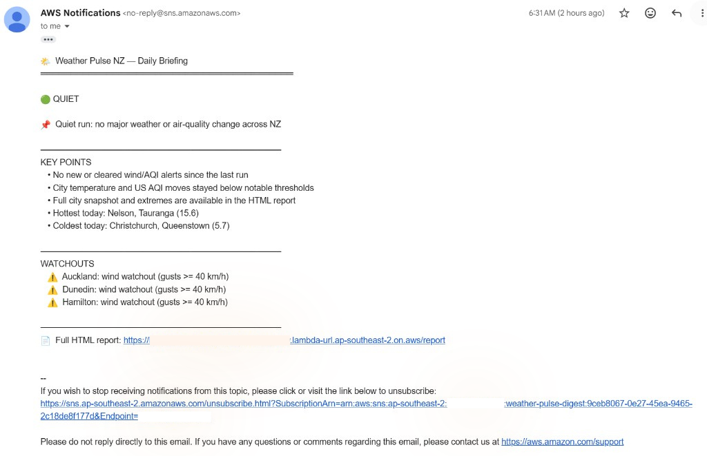
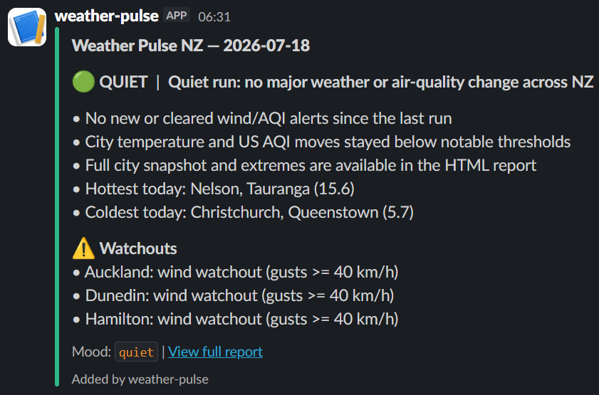
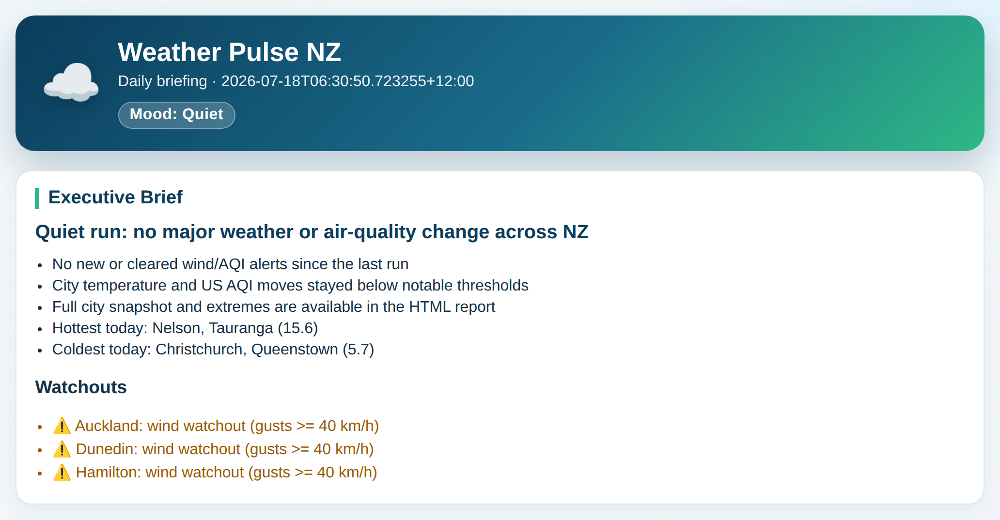
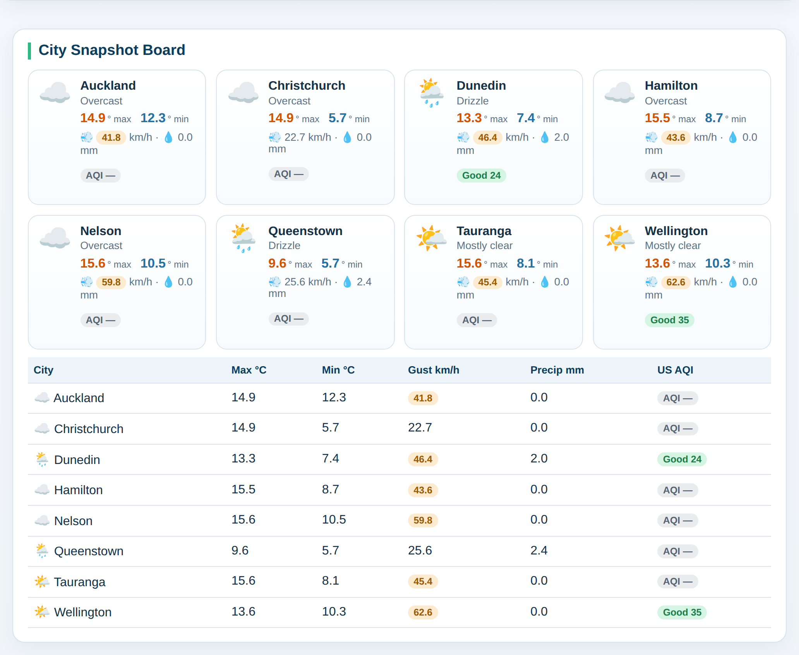
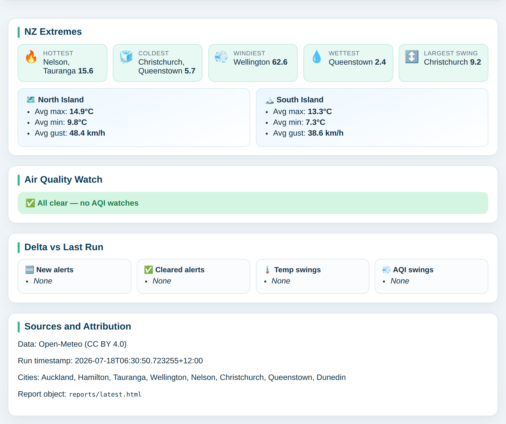
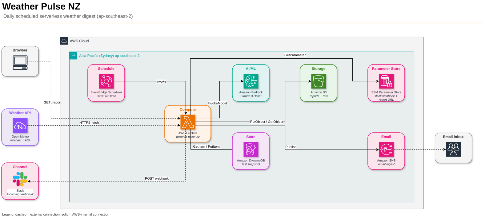

# Weekend Agent Challenge — Builder Center Article

Paste-ready fields for [AWS Builder Center](https://builder.aws.com).  
Sample style reference: [Weekend Productivity Challenge: PR Readiness Coach](https://builder.aws.com/content/3GP54hvnhrtL72pbGh3P7WQXBYN/weekend-productivity-challenge-pr-readiness-coach).

---

## Image upload kit (follow this order)

Upload these from `docs/demo/captures/` into the Builder Center article editor where the placeholders appear below. Prefer **drag-and-drop / insert image** in Builder Center rather than raw GitHub hotlinks (more reliable for readers).

| # | Insert after… | File to upload | Alt / caption |
| - | ------------- | -------------- | ------------- |
| 1 | “How it reports back” (email) | [`email.png`](captures/email.png) | SNS daily briefing email |
| 2 | Same section (Slack) | [`slack.png`](captures/slack.png) | Mood-colored Slack digest |
| 3 | Same section (report · brief) | [`report-01-brief.png`](captures/report-01-brief.png) | HTML report — executive brief |
| 4 | Same section (report · cities) | [`report-02-cities.png`](captures/report-02-cities.png) | HTML report — city snapshot board |
| 5 | Same section (report · extremes) | [`report-03-extremes.png`](captures/report-03-extremes.png) | HTML report — extremes, AQI, deltas |
| 6 | Architecture Overview | [`arch.png`](captures/arch.png) | Weather Pulse NZ architecture (AWS icons) |

**Also embed / link:** demo video [https://youtu.be/cfpqOgOjKOI](https://youtu.be/cfpqOgOjKOI)

> **Privacy:** Before upload, confirm `email.png` has the Function URL **and** SNS unsubscribe line (account ID + email) redacted. Do not upload an unredacted Gmail still.

---

## Builder Center form fields

### Title

```text
Weekend Agent Challenge: Weather Pulse NZ
```

### Tag

```text
#agents
```

### Description

```text
A scheduled AWS agent that fetches NZ weather and air quality each morning, compares against yesterday, and delivers a Bedrock digest to email, Slack, and a private HTML report.
```

### Body

Copy everything from **Vision & What the Agent Does** through **Link to App or Repo** into the article body.  
Where you see ``, **replace with the uploaded image** in Builder Center (or keep the markdown if the platform resolves relative/media uploads).

---

## Vision & What the Agent Does

Weather Pulse NZ is an always-on morning agent for New Zealand. Every day at **06:30** `Pacific/Auckland`, it wakes up on its own — no button click, no human in the loop — pulls forecast and air quality for eight cities, compares the day against the previous run, and ships a short briefing to the places people already look: **email**, **Slack**, and a **full HTML report**.

**Problem it solves.** Weather and air-quality noise is scattered across apps and alerts. I wanted one NZ-local digest that answers three questions before work starts: What is the mood of the day? What changed since yesterday? Where are the watchouts (wind, AQI)?

**What triggers it.** Amazon EventBridge Scheduler fires the agent once per day in `ap-southeast-2`, with retries if the invoke fails. The schedule uses NZ local time so NZST/NZDT transitions stay correct.

**Autonomous actions each run.**

1. Fetch Open-Meteo forecast + US AQI for Auckland, Hamilton, Tauranga, Wellington, Nelson, Christchurch, Queenstown, and Dunedin.
2. Compute nationwide extremes, North vs South Island contrast, and threshold flags (for example wind gusts ≥ 40 km/h).
3. Load the last-run snapshot from DynamoDB and compute deltas (new/cleared alerts, notable swings).
4. Build an executive brief (headline, bullets, mood: quiet / notable / severe). Mood comes from thresholds and deltas; Amazon Bedrock Claude 3 Haiku narrates the digest, with a deterministic template fallback if Bedrock is unavailable.
5. Write private S3 objects (`reports/latest.html` plus dated `raw/` JSON), publish SNS email, and post a mood-colored Slack message.
6. Expose a short Lambda Function URL (`…/report`) that GETs the HTML from private S3 — no long pre-signed URL in the address bar. Non-GET requests return **405** so the public URL cannot trigger the pipeline.

**How it reports back.** Readers get the digest in SNS email and Slack (with “View full report”), and can open the Function URL for the city board, extremes, AQI watch, and delta section.

<!-- IMAGE 1 — upload captures/email.png -->


*Figure 1. SNS email digest — mood, key points, watchouts, and short report link.*

<!-- IMAGE 2 — upload captures/slack.png -->


*Figure 2. Slack Incoming Webhook — mood-colored attachment and “View full report”.*

<!-- IMAGE 3 — upload captures/report-01-brief.png -->


*Figure 3. HTML report — hero + executive brief (served at `…/report`).*

<!-- IMAGE 4 — upload captures/report-02-cities.png -->


*Figure 4. HTML report — city snapshot board for all eight NZ cities.*

<!-- IMAGE 5 — upload captures/report-03-extremes.png -->


*Figure 5. HTML report — NZ extremes, air quality watch, and delta vs last run.*

**Demo video:** [https://youtu.be/cfpqOgOjKOI](https://youtu.be/cfpqOgOjKOI)

## How You Built It

I started from product specs in Kiro (`.kiro/specs/weather-pulse-nz/` — requirements, design, tasks) so the agent stayed a *scheduled pipeline*, not a chat UI. Infrastructure is Terraform in `ap-southeast-2`: Lambda, EventBridge Scheduler, DynamoDB, S3, SNS, SSM Parameter Store, IAM, and a Function URL.

**Key decisions**

- **Schedule over chat.** The Weekend Agent Challenge asks for autonomy. EventBridge Scheduler is the contract: same local time every morning.
- **Mood from facts, prose from Bedrock.** Thresholds and deltas always own the mood; Claude 3 Haiku only narrates. If Bedrock fails, a template path still ships a usable briefing.
- **Private report, short link.** Keeping the S3 bucket private and proxying HTML through `GET /report` avoids leaking long-lived pre-signed URLs in Slack/email while still giving a clean browser URL.
- **SSM for the Slack webhook.** The webhook is a SecureString; Terraform can create a placeholder, and the real value is set once without putting secrets in git.

**Challenges and how they were overcome**

- **First-run deltas.** With no prior snapshot, “quiet” vs “bad AQI” could mislead. The agent treats first run / missing comparison explicitly and still surfaces absolute watchouts.
- **Function URL abuse.** Early on, any method on the Function URL could hit the handler. A method gate returns **405** for non-GET so the public endpoint only serves report assets.
- **Bedrock access.** Model access and IAM must exist in-region; the template fallback keeps the daily run useful when inference is denied or times out.
- **Demo for a general audience.** Ops docs are detailed; the walkthrough focuses on architecture, email, Slack, and a three-part HTML report so viewers see the product, not Terraform commands.

Development loop: local `pytest`, Terraform plan/apply, manual `aws lambda invoke`, then verify CloudWatch logs, SNS, Slack, and `…/report`.

## AWS Services Used / Architecture Overview

| Service | Role |
| --- | --- |
| **Amazon EventBridge Scheduler** | Daily trigger at 06:30 `Pacific/Auckland` |
| **AWS Lambda** | Agent runtime (Python) + Function URL for report/assets |
| **Amazon DynamoDB** | Last-run snapshot for deltas |
| **Amazon S3** | Private HTML report + raw JSON archive |
| **Amazon Bedrock** | Claude 3 Haiku narrative digest |
| **Amazon SNS** | Email delivery of the digest |
| **AWS Systems Manager Parameter Store** | Slack webhook (SecureString) + report link URL |
| **Amazon CloudWatch Logs** | Execution logs (`/aws/lambda/weather-pulse-nz`) |
| **IAM** | Least-privilege roles for invoke, S3, DynamoDB, Bedrock, SNS, SSM |

**External:** Open-Meteo (forecast + AQI), Slack Incoming Webhook, reader browser.

<!-- IMAGE 6 — upload captures/arch.png -->


*Figure 6. Architecture — EventBridge Scheduler → Lambda in ap-southeast-2, with private S3 report via Function URL. Source: [`docs/weather-pulse-nz-architecture.drawio`](https://github.com/jajera/weather-pulse-agent/blob/main/docs/weather-pulse-nz-architecture.drawio).*

**Architecture sketch (text)**

```text
EventBridge Scheduler (06:30 NZ)
        │
        ▼
   Open-Meteo - - ► AWS Lambda (forecast + AQI)
        │
        ├── DynamoDB (last snapshot)
        ├── Bedrock Claude 3 Haiku (template fallback)
        ├── S3 private reports/ + raw/
        ├── SSM Parameter Store
        ├── SNS - - ► email
        └── Slack Incoming Webhook

Browser - - GET /report - ► Lambda Function URL ──GetObject──► S3
```

Region: **ap-southeast-2**. Steady-state cost stays low — one scheduled run per day.

## What You Learned

- **Autonomy is a product choice.** A clear schedule, retries, and a fallback digest matter more than a clever prompt alone.
- **Separate “truth” from “voice.”** Letting thresholds own mood and Bedrock own wording made failures graceful and demos trustworthy.
- **Public edges need design.** A short Function URL is friendlier than a pre-signed URL, but it must be read-only and method-gated.
- **Specs speed weekend builds.** Kiro requirements → design → tasks kept Terraform and Lambda aligned with the story I wanted to tell in this article.
- **Show the outputs.** For a general audience, architecture + email + Slack + HTML report communicate the agent better than a pure IaC walkthrough.

## Link to App or Repo

**Public repository:** [https://github.com/jajera/weather-pulse-agent](https://github.com/jajera/weather-pulse-agent)

**Demo:** [https://youtu.be/cfpqOgOjKOI](https://youtu.be/cfpqOgOjKOI)

Deployed report URL is account-specific (`terraform output -raw report_link_url`). Clone the repo, set `terraform.tfvars`, apply, confirm SNS email, set the Slack webhook in SSM, and invoke once — full steps in [`docs/runbook.md`](https://github.com/jajera/weather-pulse-agent/blob/main/docs/runbook.md).

```bash
git clone https://github.com/jajera/weather-pulse-agent.git
cd weather-pulse-agent/terraform
cp terraform.tfvars.example terraform.tfvars   # email + unique bucket
terraform init && terraform apply
```

---

## Checklist before publish

- [ ] Title: `Weekend Agent Challenge: Weather Pulse NZ`
- [ ] Tag `#agents`
- [ ] Body ≥ 500 words
- [ ] Upload **6 images** in order (email → Slack → report×3 → architecture)
- [ ] Confirm `email.png` redacts Function URL + SNS account/email
- [ ] Demo video linked: [https://youtu.be/cfpqOgOjKOI](https://youtu.be/cfpqOgOjKOI)
- [ ] Repo public: https://github.com/jajera/weather-pulse-agent
- [ ] Publish between **July 17, 12:00 AM PT** and **July 20, 2026, 1:00 PM PT**
